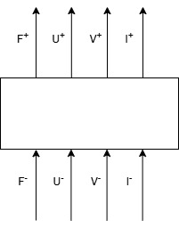

# Mathematical Background

This document provides a detailed derivation of the mathematical model used in **xMasonV2** for simulating cascaded piezoelectric transducers. 
The model builds on Sittig’s transfer matrix formalism [1], which extends Mason’s equivalent circuit model [2] to multi-layer configurations, and was later applied by Almohimeed [3] for the design of PVDF transducers.

## Table of Contents

1. [Overview](#overview)
2. [Layer Representation](#layer-representation)
3. [Transfer Matrix Formulation](#transfer-matrix-formulation)
4. [Electrical Impedance Calculation](#electrical-impedance-calculation)
5. [Appendix: Layer Matrices](#appendix-layer-matrices)
6. [Appendix: Material Relations](#appendix-material-relations)
7. [References](#references)

## Overview

A detailed derivation of the mathematical model is outside the scope of this documentation, but we provide a general high-level overview to help understand how the code works. We provide references and further reading at the end of this documentation.

Each layer of a transducer can be abstracted as a black box with four quantities acting on the top and bottom surface:
- Force **F** applied to the surface
- Speed **U** of the surface
- Potential **V** at the surface
- Current **I** flowing into/out of the surface

<p style="text-align: center"></p>

## Layer Representation

Following Sittig's work [1], it is possible to formulate a 4×4 matrix that satisfies the following relationship:

```math
\begin{align}
\begin{pmatrix}
F_i^- \\
U_i^- \\
V_i^- \\
I_i^- \\
\end{pmatrix}
=
T_i
\begin{pmatrix}
F_i^+ \\
U_i^+ \\
V_i^+ \\
I_i^+ \\
\end{pmatrix}
\end{align}
```

Where the superscript - and + denote the bottom and top quantities respectively. $T_i$ is a matrix that depends on the material parameters of the layer, wiring scheme, and frequency.

The work of Sittig builds on top of Mason's equivalent circuit [2] (MEC). The MEC is one of the first models that attempted to model piezoelectric transducers. The strategy is to convert the transducer into an electromechanical circuit and perform conventional electrical network analysis. The original method is limited to single-layer transducers and neglects losses. Sittig uses this matrix formalism to extend the model to stacked layer designs (cascaded).

## Cascading Layers

The idea is that the bottom quantities of one layer are the top quantities of the next. We can therefore insert the equation of one layer into the equation for the next one. By multiplying each 4×4 matrix of each layer (layer matrices $T_i$) we obtain one final 4×4 matrix that connects the top and bottom quantities of the whole transducer stack (transducer matrix $M$):

```math
\begin{align}
    \begin{pmatrix}
        F^-_1 \\
        U^-_1 \\
        V^-_1 \\
        I^-_1
    \end{pmatrix}
    = \prod_{i=0}^NT_i
    \begin{pmatrix}
    F^+_N \\
    U^+_N \\
    V^+_N \\
    I^+_N
    \end{pmatrix}
    = M
    \begin{pmatrix}
    F^+_N \\
    U^+_N \\
    V^+_N \\
    I^+_N
    \end{pmatrix}
\end{align}
```

Where N is the index of the last layer of the transducer.

## Boundary Conditions and Simplification

We can eliminate some quantities from the previous expression to reduce its complexity. We can summarize the force and speed at one of the surfaces as one constant acoustic impedance:

```math
\begin{align}
  Z_b=\frac{F^-_N}{U^-_N}
\end{align}
```

Where the subscript **b** denotes the backing medium impedance (material in contact with the back of the transducer, could be air if it isn't attached to anything) and the subscript **p** denotes the propagation medium impedance (material in contact with the front of the transducer, could be skin, or again air).

Depending on the wiring, we can also eliminate two of the four electrical quantities. For example, for series connection, one side is grounded and the other is the supply voltage: $V_1=0$ and $V_N=V$ where $V$ is the supply voltage. For detailed explanation of other cases, consult [3].

## Transfer Matrix Formulation

With these changes, we can reduce the equation system to a "transfer function" form:

```math
\begin{align}
    \begin{pmatrix}
        V \\ I
    \end{pmatrix}
    =
    \begin{pmatrix}
        A & B \\ C & D
    \end{pmatrix}
    \begin{pmatrix}
        F_p \\ U_p
    \end{pmatrix}
\end{align}
```

The 2×2 matrix is known in the code as "transfer matrix". It connects the mechanical quantities of the top surface (in this case the one in contact with the propagation medium) $F_p$ and $U_p$ with the electrical quantities $V$ and $I$.

The components for the transfer matrix are obtained from the transducer matrix $M$:

```math
\begin{align}
    M =
    \begin{pmatrix}
        M_{11} & M_{12} & M_{13} & M_{14} \\
        M_{21} & M_{22} & M_{23} & M_{24} \\
        M_{31} & M_{32} & M_{33} & M_{34} \\
        M_{41} & M_{42} & M_{43} & M_{44} \\
    \end{pmatrix}
\end{align}
```

The transfer matrix components are:

```math
\begin{align}
    A=-M_{33}\left(\frac{M_{21}Z_b-M_{11}}{M_{23}Z_b-M_{13}}\right)\\
    B=M_{33}\left(\frac{M_{22}Z_b-M_{12}}{M_{23}Z_b-M_{13}}\right)\\
    C=M_{41}-M_{43}\left(\frac{M_{21}Z_b-M_{11}}{M_{23}Z_b-M_{13}}\right)\\
    D=-M_{42}+M_{43}\left(\frac{M_{22}Z_b-M_{12}}{M_{23}Z_b-M_{13}}\right)
\end{align}
```

## Electrical Impedance Calculation

To obtain the electrical impedance, we can finally rearrange the transfer matrix expression into:

```math
\begin{align}
\frac{V}{I}=Z_E=\frac{AZ_p+B}{CZ_p+D}
\end{align}
```

Where we exploit the previously introduced relation to calculate the acoustic impedance $Z$ from the force and velocity.

---

# Appendix: Layer Matrices

This section lists the matrices corresponding to the previously introduced wiring schemes: series, parallel, and alternating-parallel connections. 
The purpose here is solely to present these matrices, not to derive them. For a detailed derivation and discussion, we refer the reader to Almohimeed’s work [3].

## Material Constants

Before presenting the matrices, we introduce the used constants:

- Angular frequency of the power supply: $\omega$
- Longitudinal speed of sound: $v$
- Density: $\rho$
- Cross-sectional area of transducer: $A_s$
- Dielectric loss: $\text{tan}\delta_e$
- Mechanical loss: $\text{tan}\delta_m$
- Complex elastic stiffness constant: $c^*=c^D(1+j\text{tan}\delta_m)$
- Complex dielectric permittivity: $\varepsilon^* = \varepsilon^S(1-j\text{tan}\delta_e)$
- Clamped bulk capacitance: $C = \frac{\epsilon^* A_s}{d}$
- Piezoelectric constant: $h$ (note: sign determines polarization direction)

## Helper Variables

Wave propagation constant:
```math
\begin{align}
    \beta = j \rho v \left( 1 + \frac{j \text{tan}\delta_m}{2}\right)A_s
\end{align}
```

Transmitting constant:
```math
\begin{align}
    \gamma = j \left(\frac{\omega}{v}\right)
    \left( 1 - \frac{j \text{tan}\delta_m}{2}\right)
\end{align}
```

## Series Connection Matrix

For the series connection scheme:

```math
\begin{align}
  \begin{pmatrix}
      F^-_1 \\
      -U^-_1 \\
      V^-_1 \\
      I
  \end{pmatrix}
  = S^M_{\{N\}}
  \begin{pmatrix}
      F^+_N \\ U^+_N \\ V^+_N \\ I
  \end{pmatrix}
\end{align}
```

```math
\begin{align}
    \boxed{S^M=
    \begin{pmatrix}
        \text{cosh}\gamma d & j\beta \text{sinh}\gamma d &
        0 & \frac{-jh(1-\text{cosh}\gamma d)}{\omega} \\
        \frac{-j\text{sinh}\gamma d}{\beta} & \text{cosh}\gamma d &
        0 & \frac{h\text{sinh}\gamma d}{\beta \omega} \\
        \frac{h\text{sinh}\gamma d}{\beta \omega} & \frac{-jh(1-\text{cosh}\gamma d)}{\omega} &
        1 & \frac{-j}{C\omega}\left(1-\frac{h^2C\text{sinh}\gamma d}{\beta \omega}\right) \\
        0 & 0 & 0 & 1
    \end{pmatrix}}
\end{align}
```

```math
\begin{align}
    S^M_{\{N\}}=\prod_{k=1}^N S^M_k
\end{align}
```

**Note**: Due to the nature of series connection, the current flow at the bottom and top surfaces must be equal. For this reason the superscript is dropped.

## Notational Conventions

Two important conventions must be mentioned:

1. **Polarization direction** is given by the sign of $h$. The positive polarization direction is from the bottom to the top surface.

2. **Bottom surface speed** is multiplied by -1. All other quantities have their positive direction oriented according to the polarization convention (from bottom to top is positive). The speed, however, is positive when it points into the layer, meaning that the bottom and top speeds have opposite directions:

```math
    U^+_i = -U^-_{i+1}
```

This decision originated in Ohigashi's work [4]. Almohimeed uses Ohigashi's formulation for single-layer transducers as a base and keeps this convention, though not explicitly stated. For consistency, we use the same convention.

## Parallel Connection Matrix

For the parallel connection scheme:

```math
\begin{align}
    \begin{pmatrix}
        F^-_1 \\ -U^-_1 \\ V \\ I^-_1
    \end{pmatrix}
    = P^M_{\{N\}}
    \begin{pmatrix}
        F^+_N \\ U^+_N \\ V \\ I^+_N
    \end{pmatrix}
\end{align}
```

```math
\begin{align}
    \boxed{
        P^M=
        \begin{pmatrix}
            \frac{\text{cosh} \gamma d - X \text{sinh} \gamma d}{1 - X \text{sinh} \gamma d} &
            \frac{j\beta[\text{sinh} \gamma d+2X(1-\text{cosh} \gamma d)]}{1 - X \text{sinh} \gamma d} &
            \frac{hC(1-\text{cosh} \gamma d)}{1 - X \text{sinh} \gamma d} &
            0 \\
            \frac{-j\text{sinh} \gamma d}{\beta (1 - X \text{sinh} \gamma d)} &
            \frac{\text{cosh} \gamma d - X \text{sinh} \gamma d}{1 - X \text{sinh} \gamma d} &
            \frac{jhC\text{sinh} \gamma d}{\beta (1 - X \text{sinh} \gamma d)} &
            0 \\
            0 & 0 & 1 & 0 \\
            \frac{-jhC\text{sinh} \gamma d}{\beta (2 - X \text{sinh} \gamma d)} &
            \frac{-hC(1-\text{cosh} \gamma d)}{1 - X \text{sinh} \gamma d} &
            \frac{jC\omega}{1 - X \text{sinh} \gamma d} &
            1
        \end{pmatrix}
    }
\end{align}
```

Where:
```math
\begin{align}
    X=\frac{h^2C}{\beta \omega}
\end{align}
```

```math
\begin{align}
    P^M_{\{N\}}=\prod_{k=1}^N P^M_k
\end{align}
```

**Note**: Due to the nature of parallel circuits, there is only one common potential across all layers, and therefore the superscript is dropped.

## Alternating Parallel Connection Matrix

For the alternating parallel scheme, the matrix is almost identical to the parallel connection. The only difference is that the last two entries of the diagonal are now -1 to account for the alternating voltage directions and currents:

```math
\begin{align}
    \begin{pmatrix}
        F^-_1 \\ -U^-_1 \\ V \\ I^-_1
    \end{pmatrix}
    = \dot{P}^M_{\{N\}}
    \begin{pmatrix}
        F^+_N \\ U^+_N \\ V \\ I^+_N
    \end{pmatrix}
\end{align}
```

```math
\begin{align}
    \boxed{
        \dot{P}^M=
        \begin{pmatrix}
            \frac{\text{cosh} \gamma d - X \text{sinh} \gamma d}{1 - X \text{sinh} \gamma d} &
            \frac{j\beta[\text{sinh} \gamma d+2X(1-\text{cosh} \gamma d)]}{1 - X \text{sinh} \gamma d} &
            \frac{hC(1-\text{cosh} \gamma d)}{1 - X \text{sinh} \gamma d} &
            0 \\
            \frac{-j\text{sinh} \gamma d}{\beta (1 - X \text{sinh} \gamma d)} &
            \frac{\text{cosh} \gamma d - X \text{sinh} \gamma d}{1 - X \text{sinh} \gamma d} &
            \frac{jhC\text{sinh} \gamma d}{\beta (1 - X \text{sinh} \gamma d)} &
            0 \\
            0 & 0 & 1 & 0 \\
            \frac{-jhC\text{sinh} \gamma d}{\beta (2 - X \text{sinh} \gamma d)} &
            \frac{-hC(1-\text{cosh} \gamma d)}{1 - X \text{sinh} \gamma d} &
            \frac{jC\omega}{1 - X \text{sinh} \gamma d} &
            1
        \end{pmatrix}
    }
\end{align}
```

```math
\begin{align}
    \dot{P}^M_{\{N\}}=\prod_{k=1}^N \dot{P}^M_k
\end{align}
```

## Non-Piezoelectric (Mechanical) Layers

For purely mechanical layers we observe no piezoelectric effects: $h=0$ and no capacitive effects: $C=0$ (mechanical layers are sandwiched between two electrodes with the same potential, so no charge buildup can occur). From this we have:

```math
\begin{align}
    \boxed{
    P^{np}=
        \begin{pmatrix}
            \text{cosh} \gamma d & j\beta \text{sinh}\gamma d & 0 & 0 \\
            j\frac{\text{sinh}\gamma d}{\beta} & \text{cosh} \gamma d & 0 & 0 \\
            0 & 0 & 1 & 0 \\
            0 & 0 & 0 & 1
        \end{pmatrix}
    }
\end{align}
```

---

# Appendix: Material Relations

Manufacturers don't always make all material parameters available. As such, we want to highlight some relations from [5] that we have leveraged in our simulation.

## Stiffness from Compliance

For our model, it is necessary to know the stiffness constant $c^*$, which is an entry of the stiffness tensor of the material of our choice. We have found the compliance tensor components to be more common. Another common alternative would be all the Young's moduli and Poisson's ratios; however, we employed the compliance tensor approach.

For many materials, the compliance tensor is:

```math
\begin{align}
    s=
    \begin{pmatrix}
        s_{11} & s_{12} & s_{13} & 0 & 0 & 0 \\
        s_{21} & s_{22} & s_{23} & 0 & 0 & 0 \\
        s_{31} & s_{32} & s_{33} & 0 & 0 & 0 \\
        0 & 0 & 0 & s_{44} & 0 & 0 \\
        0 & 0 & 0 & 0 & s_{55} & 0 \\
        0 & 0 & 0 & 0 & 0 & s_{66} \\
    \end{pmatrix}
\end{align}
```

The inverse of this matrix is the stiffness matrix. However, we are not interested in shear displacement, therefore we can drop the last three columns and rows as they do not affect the first three rows and columns when taking the inverse:

```math
\begin{align}
    c=
     \begin{pmatrix}
        c_{11} & c_{12} & c_{13} \\
        c_{21} & c_{22} & c_{23} \\
        c_{31} & c_{32} & c_{33} \\
    \end{pmatrix}
    =
     \begin{pmatrix}
        s_{11} & s_{12} & s_{13} \\
        s_{21} & s_{22} & s_{23} \\
        s_{31} & s_{32} & s_{33} \\
    \end{pmatrix}^{-1}
\end{align}
```

We furthermore assumed **transverse isotropy** in our materials, thus reducing the required tensor components to four:

```math
\begin{align}
    c=
     \begin{pmatrix}
        c_{11} & c_{12} & c_{13} \\
        c_{12} & c_{11} & c_{13} \\
        c_{13} & c_{13} & c_{33} \\
    \end{pmatrix}
    =
     \begin{pmatrix}
        s_{11} & s_{12} & s_{13} \\
        s_{12} & s_{11} & s_{13} \\
        s_{13} & s_{13} & s_{33} \\
    \end{pmatrix}^{-1}
\end{align}
```

## Complex-Valued Material Parameters

To obtain the complex-valued form of the mechanical stiffness and electric permittivity, we used the following relations respectively:

```math
\begin{align}
    c^*=c^D(1+j\text{tan}\delta_m)=c^D\left(1+\frac{j}{Q_m}\right)
\end{align}
```

```math
\begin{align}
    \varepsilon^*=\varepsilon^S(1-j\text{tan}\delta_e)=
    \varepsilon^S\left(1-\frac{j}{Q_e}\right)
\end{align}
```

Where:
- $Q_m$ is the mechanical quality factor
- $Q_e$ is the electrical quality factor
- $\text{tan}\delta_m$ is the mechanical loss tangent
- $\text{tan}\delta_e$ is the electrical loss tangent

## Complex Speed of Sound

We also found that the model performance can be improved by using a complex-valued speed of sound obtained from the complex-valued stiffness constant:

```math
\begin{align}
    v=\sqrt{\frac{c^*}{\rho}}
\end{align}
```

This accounts for frequency-dependent acoustic losses in the material.

---

# References

[1] E. Sittig, "Transmission parameters of thickness-driven piezoelectric transducers arranged in multilayer configurations," IEEE Transactions on Sonics and Ultrasonics, vol. 14, no. 4, pp. 167–174, 1967.

[2] W. Mason, *Electromechanical Transducers and Wave Filters*, Bell Telephone Laboratories series, D. Van Nostrand Company, 1948. [Online]. Available: https://books.google.ch/books?id=eKBRAAAAMAAJ

[3] I. Almohimeed, "Design and construction of a double-layer PVDF wearable ultrasonic sensor for the quantitative assessment of muscle contractile properties," Carleton University, 2021.

[4] H. Ohigashi, *Ultrasonic transducers in the megahertz range*, in The Applications of Ferroelectric Polymers by Wang, T.T. and Herbert, J.M. and Glass, A.M., Raymond F. Boyer Library Collection, Springer Netherlands, 1988. [Online]. Available: https://books.google.ch/books?id=epe_AAAAIAAJ

[5] B. Kar, H. Basaeri, S. Roundy, and U. Wallrabe, "Complex piezoelectric material parameters of hard PZT determined from a single disc transducer," *Smart Materials and Structures*, vol. 32, no. 8, p. 085012, June 2023. [Online]. Available: https://dx.doi.org/10.1088/1361-665X/acdd39