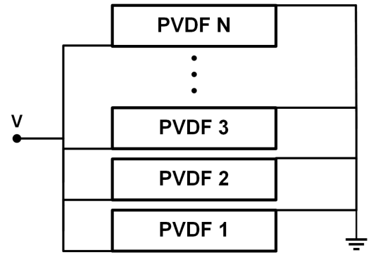
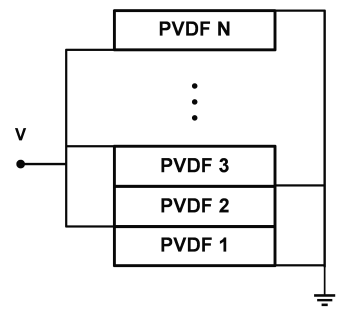

# xMasonV2

A lightweight simulation framework for cascaded piezoelectric ultrasound transducer designs, presented at the **IEEE International Ultrasonics Symposium (IUS) 2025** in Utrecht. This tool predicts the electrical impedance response across frequency bands, enabling fast identification of resonance frequencies and efficient design optimization of piezoelectric transducers.

## Features

- **YAML-configured batch processing** for reproducible research experiments
- **Multi-layer cascaded designs** with configurable wiring schemes (series, parallel, alternating parallel)
- **Impedance prediction** over user-defined frequency bands
- **S11, return loss, SWR** and other RF output quantities
- **Smith chart visualization** via scikit-rf
- **Material database** with YAML-defined material properties and validation

## Quick Start

### Prerequisites

- Python 3.10 or higher
- pip package manager

### Installation

```bash
# Clone the repository
git clone https://github.com/PVDF-ultrasound/xMasonV2
cd xMasonV2

# Install dependencies
pip install -r requirements.txt
```

### Running Simulations

#### General YAML Batch Processing

For reproducible research workflows:

```bash
cd simulation_scripts
python run_local_yamlsim.py
```

Configure your transducer in a YAML file (see `simulation_scripts/config/pvdfstack.yaml` for reference):

```yaml
# Example PVDF transducer configuration
diameter: 10  # mm (alternative: side_length or area)
connection: parallel-alternating
backing-material: Air
transmission-material: Water

source-impedance: 50  # Ohm (optional, defaults to 50)

frequency-band:
  min: 1    # MHz
  max: 100  # MHz
  step: 0.001  # MHz (optional, defaults to 0.001)

output:
  - impedance
  - S11
  - S11-phase
  - return-loss

transducer:  # thickness in micrometers
  - {material: "Au", thickness: 0.2}
  - {material: "P(VDF-TrFE)", thickness: 12, polarization: down}
  - {material: "Au", thickness: 0.2}
  - {material: "P(VDF-TrFE)", thickness: 12, polarization: up}
  - {material: "Au", thickness: 0.2}
```

Results are saved to a timestamped output directory with:
- CSV files with frequency-impedance data and all requested output quantities
- Interactive Plotly plots (impedance, S11, return loss, SWR)
- Smith chart (PNG, via scikit-rf)

## Repository Structure

```
xMasonV2/
├── app/                              # Core simulation engine
│   ├── models/
│   │   ├── layer.py                 # Single layer representation
│   │   ├── matrices.py              # Transfer matrix computations
│   │   └── transducer.py            # Transducer model & impedance calculation
│   ├── pipeline/
│   │   ├── config_parser.py         # YAML config parsing & validation
│   │   ├── simulation.py            # Frequency sweep execution
│   │   ├── plotting.py              # Plotly result visualization
│   │   └── results_io.py            # CSV export
│   ├── analysis/
│   │   └── rf_utils.py              # scikit-rf bridge & Smith chart
│   └── utils/
│       └── logger.py                # Logging configuration
│
├── simulation_scripts/               # Executable scripts
│   ├── run_local_yamlsim.py         # Main YAML batch processor
│   └── config/                      # Example configurations
│       ├── pvdfstack.yaml
│       └── pztstack.yaml
│
├── material_database/                # Material properties database
│   ├── materials/                   # YAML source definitions
│   ├── build/                       # Compiled materials (JSON)
│   ├── scripts/                     # Compilation tools
│   └── src/material_database/       # Loader API
│
└── README.md
```

## Key Concepts

### Cascaded Transducer Design

This framework simulates transducers built by stacking layers of different materials in a "lasagna" fashion. Each layer can be:
- **Piezoelectric materials** (PVDF, PZT, etc.) with specified polarization direction
- **Mechanical layers** (electrodes, backing materials, adhesives)

### Wiring Schemes

The model supports three electrode connection configurations:

- **Series**: Electrodes connected in series (higher voltage, lower current)
- **Parallel**: Electrodes connected in parallel (lower voltage, higher current)
- **Alternating Parallel**: Parallel connection with alternating current directions




*Left: Parallel configuration. Right: Alternating parallel with alternating current directions.*

Credit: Ibrahim AlMohimeed, "Design and Construction of a Double-Layer PVDF Wearable Ultrasonic Sensor" [1]

### Polarization Direction

Piezoelectric layers have a polarization direction (conventionally from bottom to top surface = positive). In the configuration files:
- `polarization: up` = standard polarization (default)
- `polarization: down` = reversed polarization

Only relative polarization between layers matters. For example, "up, down, up" is functionally equivalent to "down, up, down".

## Material Database

Materials are defined as individual YAML files in `material_database/materials/` with the following properties:

- Density (rho)
- Speed of sound (v) or elastic stiffness (c33) — one is derived from the other
- Piezoelectric constant (h33) — for piezoelectric materials
- Relative permittivity (eps_r33) and dielectric loss tangent (tan_delta)
- Mechanical quality factor (Q_m)

Available materials: P(VDF-TrFE), PZT-53, Au, Air, Water, Transfertape, Nylon.

To add custom materials, create a new YAML file in `material_database/materials/` following the existing format, then run the compiler:

```bash
cd material_database
python scripts/compile.py
```

## Output Quantities

The simulation can compute and plot:

| Output | Description |
|--------|-------------|
| `impedance` | Complex electrical impedance Z(f) |
| `S11` | Reflection coefficient magnitude |
| `S11-real-imag` | S11 real and imaginary parts |
| `S11-phase` | S11 phase angle (degrees) |
| `return-loss` | Return loss in dB: 20*log10(\|S11\|) |
| `SWR` | Standing wave ratio |

## Mathematical Background

The simulation implements Sittig's transfer matrix formalism [2], extending Mason's equivalent circuit model [3] to multi-layer piezoelectric transducers. The model:

1. Represents each layer as a 4x4 transfer matrix relating force, velocity, voltage, and current
2. Cascades layers by matrix multiplication
3. Applies boundary conditions for backing and transmission media
4. Solves for electrical impedance as a function of frequency

For detailed mathematical derivation, layer matrix formulations, and material relations, see [MATHEMATICAL_BACKGROUND.md](MATHEMATICAL_BACKGROUND.md).

## License

This project is licensed under the Apache License 2.0. See [LICENSE](LICENSE) for details.

## Citation

If you use this software in your research, please cite:

```
@inproceedings{Spisani2025xMasonV2,
  author={Spisani, Gabriele and Mayer, Philipp and Papa, Sofia and Greco, Francesco and Magno, Michele and Benini, Luca and Leitner, Christoph},
  booktitle={2025 IEEE International Ultrasonics Symposium (IUS)},
  title={xMasonV2: An Open-Source Model Extension for Cascaded Transducer Arrays},
  address={Utrecht, The Netherlands},
  year={2025},
  pages={1-4},
  doi={10.1109/IUS62464.2025.11201533}
}
```

## Authors

- **Gabriele Spisani** — Integrated Systems Laboratory, ETH Zurich
- **Christoph Leitner** — Integrated Systems Laboratory, ETH Zurich, [christoph.leitner@iis.ee.ethz.ch](mailto:christoph.leitner@iis.ee.ethz.ch)

## References

[1] I. Almohimeed, "Design and construction of a double-layer PVDF wearable ultrasonic sensor for the quantitative assessment of muscle contractile properties," Carleton University, 2021.

[2] E. Sittig, "Transmission parameters of thickness-driven piezoelectric transducers arranged in multilayer configurations," IEEE Transactions on Sonics and Ultrasonics, vol. 14, no. 4, pp. 167-174, 1967.

[3] W. Mason, "Electromechanical Transducers and Wave Filters," Bell Telephone Laboratories series, D. Van Nostrand Company, 1948.

## Contributing

For questions, bug reports, or contributions, please contact the authors or open an issue on the repository.