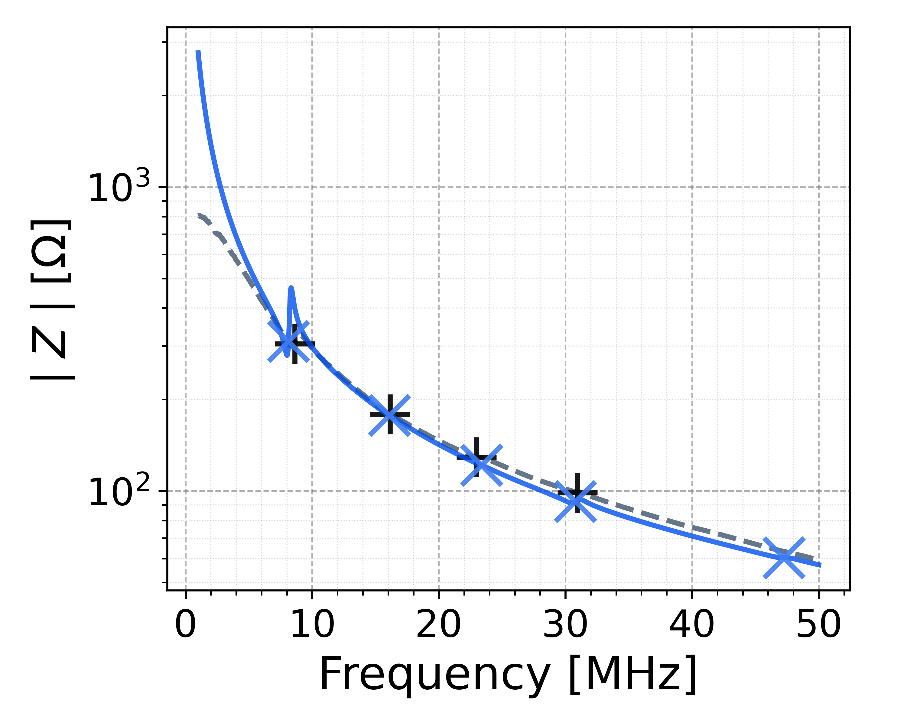
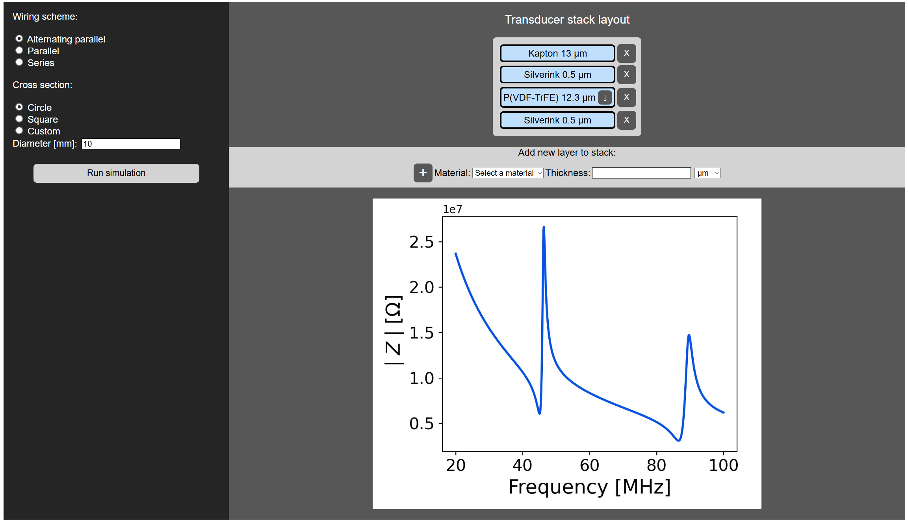

# xMasonV2  

A lightweight simulation framework for cascaded PVDF ultrasound transducer designs, presented at the **IEEE International Ultrasonics Symposium (IUS) 2025** in Utrecht. This tool predicts the electrical impedance response across frequency bands, enabling fast identification of resonance frequencies and efficient design optimization of piezoelectric transducers.  



*Example: Double-layer PVDF transducer — model prediction (blue) vs. experimental measurement (grey), with resonance frequencies indicated.*

## Features

- **Web-based interface** for interactive transducer design and simulation
- **YAML-configured batch processing** for reproducible research experiments
- **Multi-layer cascaded designs** with configurable wiring schemes (series, parallel, alternating parallel)
- **Impedance prediction** over user-defined frequency bands
- **Experimental validation** with S11 and impedance magnitude comparisons
- **Automated analysis** including resonance peak detection
- **Material library** with material properties database

## Quick Start

### Prerequisites

- Python 3.8 or higher
- pip package manager

### Installation

```bash
# Clone the repository
git clone https://github.com/PVDF-ultrasound/xMasonV2
cd xMasonV2

# Install dependencies
pip install -r requirements.txt
```

### Running Simulations

#### Method 1: Web Interface

For interactive design and exploration:

```bash
python simulation_scripts/run_local_single.py
```

Then open your browser to `http://localhost:5000`. The web interface allows you to:
- Select materials from the database
- Configure layer thicknesses and polarization
- Choose wiring schemes (series/parallel/alternating parallel)
- Adjust frequency bands dynamically
- Visualize impedance plots in real-time



#### Method 2: YAML Batch Scripts

For reproducible research workflows and batch processing:

```bash
cd simulation_scripts/IUS2025
python run_local_yamlsim.py
```

Configure your transducer in a YAML file (see `simulation_scripts/IUS2025/config/pvdfDstack.yaml` for reference):

```yaml
# Example PVDF transducer configuration
diameter: 6.35  # mm (alternative: side_length or area)
connection: parallel-alternating
backing-material: Air
transmission-material: Air

frequency-band:
  min: 1    # MHz
  max: 50   # MHz

transducer:
  - material: Au
    thickness: 0.2  # micrometers
  - material: P(VDF-TrFE)
    thickness: 120
    counter-polarized: false
  - material: Au
    thickness: 0.2
```

Results are saved to `simulation_scripts/IUS2025/result/` with:
- CSV files with frequency-impedance data
- High-resolution impedance plots
- JSON summary files with metadata

## Repository Structure

```
xMasonV2/
├── app/                          # Core simulation engine
│   ├── data/
│   │   └── data_loader.py       # Material database loader
│   ├── models/
│   │   └── tf_model.py          # Transfer matrix implementation
│   ├── utils/
│   │   └── utils.py             # Helper functions
│   ├── main.py                  # Flask web application
│   ├── static/                  # CSS and JavaScript for web UI
│   └── templates/               # HTML templates
│
├── simulation_scripts/           # Executable scripts
│   ├── run_local_single.py      # Launch web interface
│   └── IUS2025/                 # Conference-specific experiments
│       ├── run_local_yamlsim.py # YAML batch processor
│       ├── config/              # Experiment configurations
│       └── result/              # Generated outputs
│
├── data/                         # Material properties and datasets
│   └── materials.csv            # Material constants registry
│
├── docker/                       # Containerization files
├── docs/                         # Documentation assets
└── README.md                     # This file
```

## Key Concepts

### Cascaded Transducer Design
  
This framework simulates transducers built by stacking layers of different materials in a "lasagna" fashion. Each layer can be:
- **Piezoelectric materials** (PVDF, PZT, etc.) with specified polarization direction
- **Mechanical layers** (electrodes, backing materials, adhesives)

### Wiring Schemes

The model supports three electrode connection configurations:

- **Series**: Electrodes connected in series (higher voltage, lower current)
- **Parallel**: Electrodes connected in parallel (lower voltage, higher current)
- **Alternating Parallel**: Parallel connection with alternating current directions


*Left: Parallel configuration. Right: Alternating parallel with alternating current directions.*

Credit: Ibrahim AlMohimeed, "Design and Construction of a Double-Layer PVDF Wearable Ultrasonic Sensor" [1]

### Polarization Direction

Piezoelectric layers have a polarization direction (conventionally from bottom to top surface = positive). In the configuration files:
- `counter-polarized: false` = standard polarization (default)
- `counter-polarized: true` = reversed polarization

Only relative polarization between layers matters. For example, "up, down, up" is functionally equivalent to "down, up, down".

## Material Database

Materials are defined in `data/materials.csv` with the following properties:

- Density (ρ)
- Compliance tensor components (s11, s12, s13, s33)
- Piezoelectric constant (h33)
- Dielectric permittivity (ε33)
- Mechanical and dielectric loss factors (Qm, Qe)

To add custom materials, append rows to the CSV with all required parameters.

## Mathematical Background

The simulation implements Sittig's transfer matrix formalism [2], extending Mason's equivalent circuit model [3] to multi-layer piezoelectric transducers. The model:

1. Represents each layer as a 4×4 transfer matrix relating force, velocity, voltage, and current
2. Cascades layers by matrix multiplication
3. Applies boundary conditions for backing and transmission media
4. Solves for electrical impedance as a function of frequency

For detailed mathematical derivation, layer matrix formulations, and material relations, see [MATHEMATICAL_BACKGROUND.md](MATHEMATICAL_BACKGROUND.md).

## Docker Support

Build and run using Docker:

```bash
docker build -t xmason-v2 -f docker/Dockerfile .
docker run -p 5000:5000 xmason-v2
```

## License

This project is licensed under the Apache License 2.0. See [LICENSE](LICENSE) for details.

## Citation

If you use this software in your research, please cite:

```
@inproceedings{Spisani2025xMasonV2,
  author={Spisani, Gabriele and Mayer, Philipp and Papa, Sofia and Greco, Francesco and Magno, Michele and Benini, Luca and Leitner, Christoph},
  booktitle={2025 IEEE International Ultrasonics Symposium (IUS)}, 
  title={xMasonV2: An Open-Source Model Extension for Cascaded Transducer Arrays},
  address={Utrecht, The Netherlands},
  year={2025},
  pages={1-4},
  doi={10.1109/IUS62464.2025.11201533}
}
```

## Authors

- **Gabriele Spisani** — Integrated Systems Laboratory, ETH Zurich  
- **Christoph Leitner** — Integrated Systems Laboratory, ETH Zurich, [christoph.leitner@iis.ee.ethz.ch](mailto:christoph.leitner@iis.ee.ethz.ch)

## References

[1] I. Almohimeed, "Design and construction of a double-layer PVDF wearable ultrasonic sensor for the quantitative assessment of muscle contractile properties," Carleton University, 2021.

[2] E. Sittig, "Transmission parameters of thickness-driven piezoelectric transducers arranged in multilayer configurations," IEEE Transactions on Sonics and Ultrasonics, vol. 14, no. 4, pp. 167–174, 1967.

[3] W. Mason, "Electromechanical Transducers and Wave Filters," Bell Telephone Laboratories series, D. Van Nostrand Company, 1948.

## Contributing

For questions, bug reports, or contributions, please contact the authors or open an issue on the repository.
